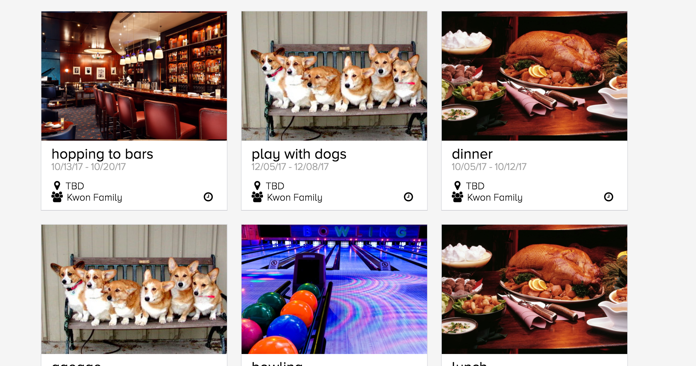
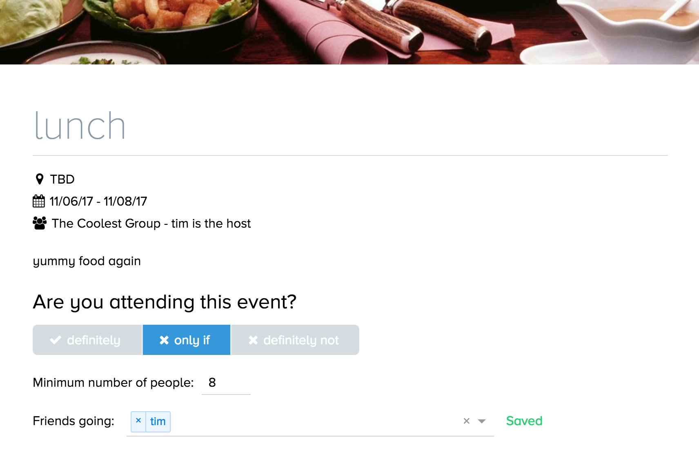
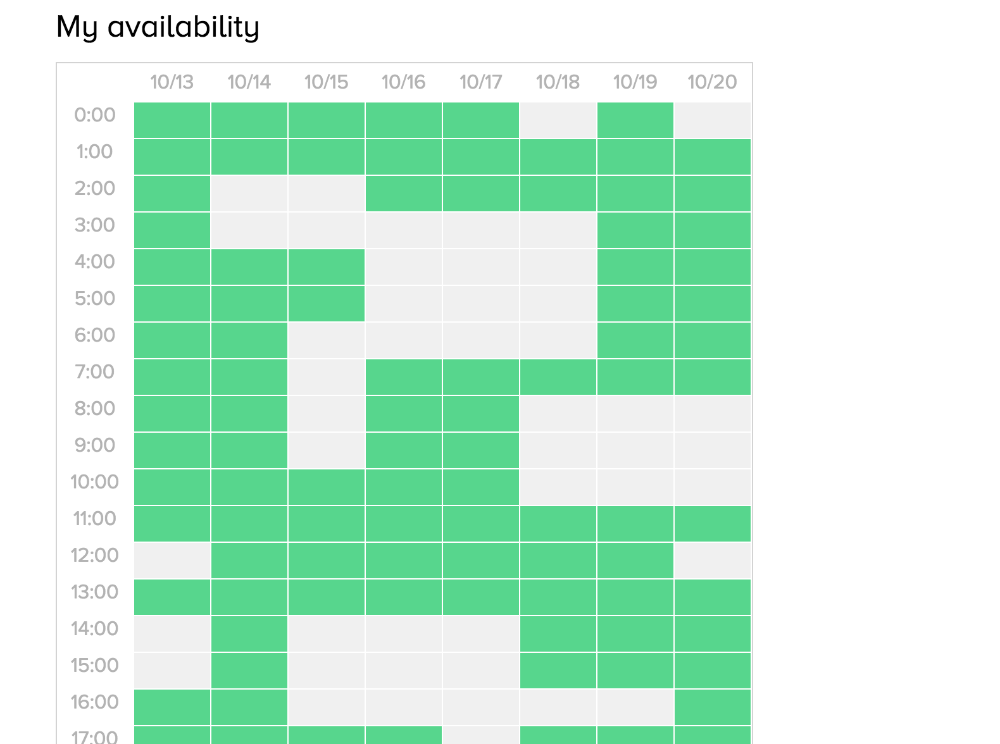

# Crit

[Crit live][heroku]

[heroku]: https://crit.herokuapp.com

Crit is a web application that allows event organizers to plan events easily and allows attendees to specify attending conditions, making committing an event less intimidating.
It utilizes Ruby on Rails on the backend, a PostgreSQL database, and React.js with a Redux architectural framework on the frontend.

## Features & Implementation

### Single-Page App

Crit is truly a single-page; all content is delivered on one static page.  The root page listens to a `SessionStore` and renders content based on a call to `SessionStore.currentUser()`.  Sensitive information is kept out of the frontend of the app by making an API call to `SessionsController#get_user`.

### Events

New Events:
Events are made at first by a member in a group, and everyone that is in the group can respond to the events, with "definitely, only if, and definitely not"

only if allows you to pick conditions that you would only want to commit to going to the event if conditions are satisfied.

### Event Time Schedule

After you are one of the finalized attendee, you can pick your availability

### Groups

There are private groups and one can make a group and invite his friends to his group. All the events make in one group are accessible by the members of the group. An admin can decide to add people, or to kick members out of the group.

